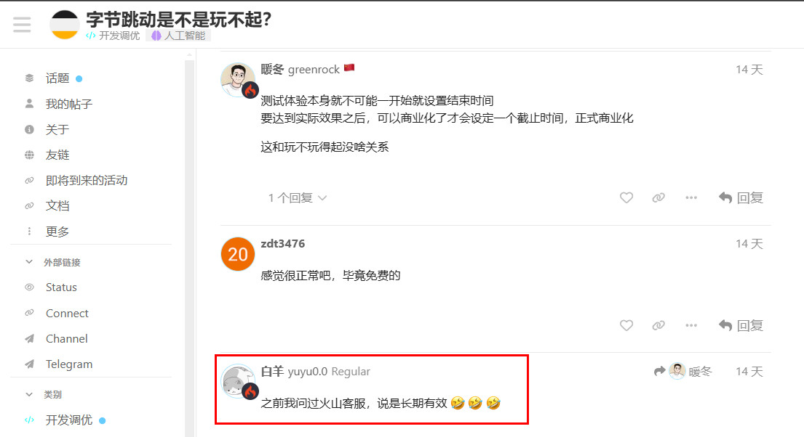
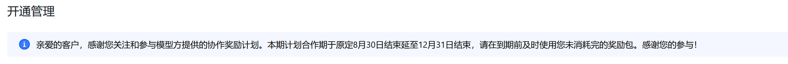

# 大语言模型服务价格汇总

2024年5月，各大模型厂商打起了“价格战”，意图拉拢更多开发者参与应用开发和模型落地探索。本仓库用于收集各大云服务厂商的大语言模型服务价格，方便用户对比。价格单位按照输入/输出每百万词元（Token）需要花费的人民币价格进行计算，美元到人民币汇率按最近一年的平均汇率7.2计算。

本仓库只是一个速查表，更详细的信息请参考各个厂商的官方价格文档。例如闲时价格、预付费价格、Batch调用价格等。

由于最近一年不同厂商的免费试用权益变动较多，获得免费权益的门槛变动也多，有效期也短，因此本仓库不收集免费试用权益包信息。

**统计模型和平台范围**：
- 只选取应用较为广泛，使用的应用数和人数较多，较为典型和具有代表性的模型和平台。以及服务价格较为便宜的平台。
- 由于本速查表主要面向翻译和中英双语应用，对于闭源且不支持中文（例如LLaMa系列）或中文支持较差的模型（例如微软的Phi系列）不会被纳入统计。
- 如果某开源模型在其官方平台已经十分便宜，那第三方平台的价格不会被纳入统计。
- 主要面向企业用户，个人用户难以申请使用的平台和模型不会被纳入统计。
- 在官方出了新模型且新模型性能提升较大，且价格相较旧模型更便宜或者持平的情况下，不再额外统计旧模型。（例如只统计LLaMa3不统计LLaMa2）
- 官方宣布即将被弃用的模型，或者描述为Older/Legacy的模型不会被纳入统计。
- 由于模型太小和/或性能不佳，连一篇完整新闻文章都翻译不下来的模型（例如qwen1.5-0.5b-chat）不会被纳入统计。

**统计数据范围**：
- 模型提供平台及定价页面
- API调用格式是否兼容OpenAI格式
- 审查情况（要求翻译[BBC政治新闻](https://www.bbc.com/news/world-asia-66727459) 检查是否存在截断和拒绝回复的情况）。
- 价格

## GPT系列
模型提供平台：[OpenAI](https://platform.openai.com/docs/pricing/) / [Azure](https://azure.microsoft.com/zh-cn/pricing/details/cognitive-services/openai-service/)（定价基本一致）

API是否兼容OpenAI格式：OpenAI的天然兼容；Azure的有自定义格式，不兼容

审查情况：无审查

价格：

最后更新日期：2025-04-18

| **模型**      | **文本模态输入价格（元/M Tokens）** | **文本模态输出价格（元/M Tokens）** | **上下文窗口大小（K）** | **备注** |
|:-----------:|:--------------------:|:--------------------:|:--------------:|:------:|
| o3 | 72 | 288 | 200 |  |
| o4-mini | 7.92 | 31.68 | 200 |  |
| gpt-4.1 | 14.4(缓存击中则打2.5折) | 57.6 | 1000 |  |
| gpt-4.1-mini | 2.88(缓存击中则打2.5折) | 11.52 | 1000 |  |
| gpt-4.1-nano | 0.72(缓存击中则打2.5折) | 2.88 | 1000 |  |
| gpt-4o-mini      | 1.08(缓存击中则打5折)    | 4.32                  | 128            |        |
| gpt-4o-mini-audio-preview      | 1.08    | 4.32                  | 128            |        |
| gpt-4o-mini-realtime-preview      | 4.32(缓存击中则打5折)    | 17.28                  | 128            |        |
| gpt-4o      | 18(缓存击中则打5折)         | 72                  | 128            |        |
| gpt-4o-audio-preview  | 18                    | 72                  | 128            |        |
| gpt-4o-realtime-preview | 36(缓存击中则打5折)                    | 144                  | 128            |        |
| o1 | 108(缓存击中则打5折)                   | 432                  | 200            |  o1-preview的上下文窗口大小为128K      |
| o1-mini | 7.92(缓存击中则打5折)                   | 31.68                  | 128            |        |
| o3-mini | 7.92(缓存击中则打5折)                   | 31.68                  | 128            |        |
| gpt-4-turbo | 72                   | 216                  | 128            |        |
| gpt-4       | 216                  | 432                  | 8              |        |
| gpt-4-32k   | 432                  | 864                  | 32             |        |
| gpt-3.5-turbo| 3.6                  | 10.8                 | 16             |        |
| gpt-4.5-preview     | 540                 | 1080                 | 128            |    即将于2025年7月下线    |

备注：openai官方平台推出了Flex processing功能，以牺牲速度和可用率为代价，降低了o3/o4-mini等推理模型的价格，和Batch调用的价格一致（打五折）。

### 微调价格

注：只适用于OpenAI官方平台，Azure平台只支持昂贵的全量微调

| **模型**      | **微调训练语料输入价格（元/M Tokens）** | **文本模态输入价格（元/M Tokens）** | **文本模态输出价格（元/M Tokens）** | **备注** |
|:-----------:|:--------------------:|:--------------------:|:--------------:|:------:|
| gpt-4o-2024-08-06      | 180    | 27(缓存击中则打5折)    | 108            |        |
| gpt-4o-mini-2024-07-18      | 21.6    | 2.16(缓存击中则打5折)    | 8.64            |        |
| gpt-3.5-turbo     | 57.6    | 21.6    | 43.2            |        |

## Claude系列
模型提供平台： [Anthropic](https://docs.anthropic.com/en/docs/models-overview#model-comparison) / [AWS](https://aws.amazon.com/cn/bedrock/pricing/) 价格类似

API是否兼容OpenAI格式：否，自定义格式

审查情况：无审查

价格：

最后更新日期：2025-02-26

| **模型**      | **输入价格（元/M Tokens）** | **输出价格（元/M Tokens）** | **上下文窗口大小（K）** | **备注** |
|:-----------:|:--------------------:|:--------------------:|:--------------:|:------:|
| claude-3.7-sonnet | 21.6 | 108 | 200 |  |
| claude-3.5-sonnet | 21.6 | 108 | 200 |  |
| claude-3.5-haiku | 5.76 | 28.8 | 200 |  |
| claude-3-opus | 108 | 540 | 200 |  |
| claude-3-sonnet | 21.6 | 108 | 200 |  |
| claude-3-haiku | 1.8 | 9 | 200 |  |

注：Claude的提示缓存需要在调用API时显式声明想要缓存的消息，缓存消息的输入价格是普通输入的1.2~1.25倍，但是命中缓存后的输入价格将降至普通输入的1/10。详见[文档](https://docs.anthropic.com/zh-CN/docs/build-with-claude/prompt-caching)。

### 微调价格

Claude官方平台暂时不支持微调。AWS平台可以，但是费用较贵。

## Gemini系列
模型提供平台： [谷歌](https://ai.google.dev/pricing) / [openrouter](https://openrouter.ai/docs#models) （注：openrouter也是调用的谷歌的API，但是是一个大池子，价格同步谷歌官方）

API是否兼容OpenAI格式：是，见[谷歌官方文档](https://ai.google.dev/gemini-api/docs/openai?hl=zh-cn)

审查情况：无审查

**谷歌官方平台随用随付**方案价格（注：以下价格中，1.5版本及以下为输入输出在128K以内的情况，超过128K翻倍）：

最后更新日期：2025-04-18

| **模型**      | **输入价格（元/M Tokens）** | **输出价格（元/M Tokens）** | **上下文窗口大小（K）** | **备注** |
|:-----------:|:--------------------:|:--------------------:|:--------------:|:------:|
| gemini-2.5-pro-exp-03-25 | 9 | 72 | 200-1000 | 输入token超过200k时价格翻倍 |
| gemini-2.5-flash-preview-04-17 | 1.08 | 4.32 | 1000 |  |
| gemini-2.5-flash-preview-04-17:thinking | 1.08 | 25.2 | 1000 |  |
| gemini-2.0-flash | 0.72(文本/图片/视频模态) / 5.04(音频模态) （命中缓存均打2.5折） | 2.88(文本模态) | 1000 |  |
| gemini-2.0-flash-lite | 0.54(所有模态) （命中缓存打2.5折） | 2.16(文本模态) | 1000 |  |
| gemini-1.5-pro | 9（命中缓存打2.5折） | 36 | 2000 |  |
| gemini-1.5-flash | 0.54 （命中缓存打2.5折） | 2.16 | 1000 |  |
| gemini-1.5-flash-8B | 0.27 （命中缓存打2.5折） | 1.08 | 1000 |  |
| gemini-1.0-pro | 3.6 | 10.8 | 32 |  |

注：Gemini的提示缓存需要在调用API时显式声明，缓存消息另有存储费用（每MTok每小时7.2元，gemini-1.5-flash-8B则为1.8元，gemini-1.5-pro为32.4元）。详见[文档](https://ai.google.dev/gemini-api/docs/caching?lang=python&hl=zh-cn)。

### 微调价格

Gemini微调暂时处于免费试用阶段，推理费用同普通版本。

## Gemma系列
模型提供平台： [谷歌](https://ai.google.dev/pricing) / [DeepInfra](https://deepinfra.com/google/gemma-3-27b-it) 等

API是否兼容OpenAI格式：开源模型，大多数部署平台支持OpenAI格式

审查情况：无审查

价格：

最后更新日期：2025-03-16

| **模型**      | **输入价格（元/M Tokens）** | **输出价格（元/M Tokens）** | **上下文窗口大小（K）** | **备注** |
|:-----------:|:--------------------:|:--------------------:|:--------------:|:------:|
| gemma-3-27b-it | 0.72 | 1.44 | 128 | DeepInfra报价 |

## Grok系列
模型提供平台： [x.ai](https://docs.x.ai/docs/models)

API是否兼容OpenAI格式：是

审查情况：无

价格：

最后更新日期：2025-04-15

| **模型**      | **输入价格（元/M Tokens）** | **输出价格（元/M Tokens）** | **上下文窗口大小（K）** | **备注** |
|:-----------:|:--------------------:|:--------------------:|:--------------:|:------:|
| grok-3 | 21.6 | 108 | 128 |  |
| grok-3-mini | 2.16 | 3.6 | 128 |  |
| grok-2-vision-1212 | 14.4 | 72 | 8 |  |

## GLM闭源系列
模型提供平台： [智谱AI](https://open.bigmodel.cn/pricing)

API是否兼容OpenAI格式：兼容，参见[文档](https://open.bigmodel.cn/dev/api#openai_sdk)。

审查情况：平台对API输出有审查，参见[审查文档](https://open.bigmodel.cn/dev/howuse/securityaudit)。

价格：

最后更新日期：2025-04-23

| **模型**      | **输入价格（元/M Tokens）** | **输出价格（元/M Tokens）** | **上下文窗口大小（K）** | **备注** |
|:-----------:|:--------------------:|:--------------------:|:--------------:|:------:|
| GLM-4-Plus | 5 | 5 | 128 | 高智能旗舰 |
| GLM-4-Air-250414 | 0.5 | 0.5 | 32 | 高性价比 |
| GLM-Z1-Air | 0.5 | 0.5 | 32 | 推理模型，高性价比 |
| GLM-Z1-AirX | 5 | 5 | 32 | 推理模型，极速推理 |
| GLM-Z1-Flash | 0 | 0 | 32 | 推理模型，免费（但有速率限制，最小并发数为5） |
| GLM-4-AirX | 10 | 10 | 8 | 高速推理 |
| GLM-4-FlashX | 0.1 | 0.1 | 128 | 高速低价 |
| GLM-4-Long | 1 | 1 | 1000 | 超长输入 |
| GLM-4-Flash | 0 | 0 | 128 | 适用简单任务，速度最快，免费（但有速率限制，最小并发数为5） |
| GLM-4V-Flash | 0 | 0 | 128 | 图像理解，免费（但有速率限制，最小并发数为5） |
| GLM-4V-Plus-0111 | 4 | 4 | 8 | 图像理解，旗舰 |
| GLM-4-Voice | 80 | 80 | 未知 | 语音模型 |

注：
- 由于ChatGLM开源版本商用API较少，计费通常也比GLM-4-Air贵，性能也和GLM-4-Air差不多，所以不统计。
- 高校师生认证后可以获得5折推理优惠。

### 微调价格

LoRA微调与使用公有实例推理价格：

| **模型**      | **微调训练语料输入价格（元/M Tokens）** | **文本模态输入价格（元/M Tokens）** | **文本模态输出价格（元/M Tokens）** | **备注** |
|:-----------:|:--------------------:|:--------------------:|:--------------:|:------:|
| GLM-4-Air 8k-int8 | 30 | 3 | 3 |  |
| GLM-4-AirX 8k-int4 | 30 | 30 | 30 |  |
| GLM-4-Flash / GLM-4-9B 8k-int8 | 25 | 2 | 2 |  |
| ChatGLM3-6B 8k-int8 | 25 | 2 | 2 |  |

## Deepseek系列
模型提供平台： [deepseek官方开放平台](https://platform.deepseek.com/api-docs/zh-cn/pricing)

API是否兼容OpenAI格式：是

审查情况：平台对API输出有审查

价格：

最后更新日期：2025-03-16

| **模型**      | **输入价格（元/M Tokens）** | **输出价格（元/M Tokens）** | **上下文窗口大小（K）** | **备注** |
|:-----------:|:--------------------:|:--------------------:|:--------------:|:------:|
| deepseek-chat（基于DeepSeek-V3） | 2（缓存命中为0.5） | 8 | 64 |  |
| deepseek-reasoner（基于DeepSeek-R1） | 4（缓存命中为1） | 16 | 64 |  |

注：
1. 字节火山引擎、硅基流动等定价与deepseek官网大致相同；
2. 阿里云的deepseek系列目前处于免费试用阶段未公布价格。

### 微调价格
deepseek暂未支持微调

## Mistral系列
模型提供平台： [mistral](https://mistral.ai/products/la-plateforme#pricing)

API是否兼容OpenAI格式：是

审查情况：无审查

价格：

最后更新日期：2025-03-23

| **模型**      | **输入价格（元/M Tokens）** | **输出价格（元/M Tokens）** | **上下文窗口大小（K）** | **备注** |
|:-----------:|:--------------------:|:--------------------:|:--------------:|:------:|
| mistral-large | 14.4 | 43.2 | 128 |  |
| pixtral-large | 14.4 | 43.2 | 128 | 图片输入：16*16像素为一个token |
| codestral | 2.16 | 6.48 | 256 |  |
| mistral-small | 1.44 | 4.32 | 128 |  |

### 微调价格

| **模型**      | **微调训练语料输入价格（元/M Tokens）** | **文本模态输入价格（元/M Tokens）** | **文本模态输出价格（元/M Tokens）** | **备注** |
|:-----------:|:--------------------:|:--------------------:|:--------------:|:------:|
| mistral-large-2411 | 64.8 | 14.4 | 43.2 | 微调模型存储费用：每个模型每月28.8元 |
| mistral-small | 21.6 | 1.44 | 4.32 | 微调模型存储费用：每个模型每月14.4元 |

备注：mistral可以欧元支付，因汇率因素会比美元支付会便宜，但是只在某些模型上便宜一点点。

## 腾讯混元系列
模型提供平台： [腾讯云](https://cloud.tencent.com/document/product/1729/97731)

API是否兼容OpenAI格式：是，参见[腾讯云文档](https://cloud.tencent.com/document/product/1729/111007)

审查情况：有审查，参见[腾讯云API文档中错误码部分](https://cloud.tencent.com/document/product/1729/101847)

价格：

最后更新日期：2025-03-23

| **模型**      | **输入价格（元/M Tokens）** | **输出价格（元/M Tokens）** | **上下文窗口大小（K）** | **备注** |
|:-----------:|:--------------------:|:--------------------:|:--------------:|:------:|
| hunyuan-t1 | 1 | 4 | 92 |  |
| hunyuan-TurboS | 0.8 | 2 | 32 |  |
| hunyuan-turbo | 2.4 | 9.6 | 32 |  |
| hunyuan-large | 4 | 12 | 32 |  |
| hunyuan-large-longcontext | 6 | 18 | 134 |  |
| hunyuan-standard | 0.5-0.8 | 2 | 32-256 |  |
| hunyuan-functioncall | 4 | 8 | 32 |  |
| hunyuan-code | 3.5 | 7 | 8 |  |
| hunyuan-turbo-vision | 80 | 80 | 8 |  |
| hunyuan-vision | 18 | 18 | 32 |  |

## 零一万物Yi系列
模型提供平台： [零一万物大模型开放平台](https://platform.lingyiwanwu.com/docs)

API是否兼容OpenAI格式：是

审查情况：平台对API输入和输出有审查

价格：

最后更新日期：2025-02-06

| **模型**      | **输入价格（元/M Tokens）** | **输出价格（元/M Tokens）** | **上下文窗口大小（K）** | **备注** |
|:-----------:|:--------------------:|:--------------------:|:--------------:|:------:|
| yi-lightning | 1 | 1 | 16 |  |
| yi-vision-v2 | 6 | 6 | 16 |  |

### 微调价格
Yi系列暂未支持微调

## 通义千问开源系列
模型提供平台： [阿里云](https://help.aliyun.com/zh/dashscope/developer-reference/tongyi-qianwen-7b-14b-72b-metering-and-billing) / [together.ai](https://api.together.xyz/models?filter=serverless) / [openrouter](https://openrouter.ai/docs#models) / [siliconflow](https://siliconflow.cn/zh-cn/pricing)

API是否兼容OpenAI格式：是，参见[阿里云文档](https://help.aliyun.com/zh/dashscope/developer-reference/compatibility-of-openai-with-dashscope/)；[together.ai文档](https://docs.together.ai/docs/openai-api-compatibility)；[openrouter文档](https://openrouter.ai/docs#requests)；[siliconflow文档](https://siliconflow.readme.io/)

审查情况：开源模型本身不存在审查；together.ai等境外平台对输入输出无审查；阿里云平台存在审查，见[文档](https://help.aliyun.com/document_detail/2712216.html)

**以下价格选自正规云计算平台的相对低的报价，上下文窗口是对应报价支持的大小，不在乎报价的话，有更大的上下文窗口推理服务可选**：

最后更新日期：2025-04-29

| **模型**      | **输入价格（元/M Tokens）** | **输出价格（元/M Tokens）** | **上下文窗口大小（K）** | **备注** |
|:-----------:|:--------------------:|:--------------------:|:--------------:|:------:|
| qwen3-235b-a22b | 1.44 | 4.32 | 128 | 平台：DeepInfra(fp8/82K) |
| qwen3-32b | 0.72 | 2.76 | 128 | 平台：DeepInfra(fp8/82K) |
| qwen3-30b-a3b | 0.72 | 2.76 | 128 | 平台：DeepInfra(fp8/82K) |
| qwen3-14b | 0.576 | 1.728 | 128 | 平台：DeepInfra(fp8/82K) |
| qwen3-8b | 0.5 | 2 | 128 | 平台：阿里云；推理输出5元 |
| qwen3-4b/1.7b/0.6b | 0.3 | 1.2 | 128 | 平台：阿里云；推理输出3元 |
| qwen2.5-omni-7b | 0.6（文本）/ 38（音频）/ 2（视觉） | 2.4（文本）/ 6（音频）| 32 | 平台：阿里云 |
| qwq-32b | 0.864 | 1.296 | 128 | 平台：DeepInfra报价 |
| qwen2.5-72b-instruct | 0.936 | 2.88 | 128 |  平台：Nebius AI Studio |
| qwen2.5-32b-instruct | 1.26 | 1.26 | 32 |  平台：硅基流动 |
| qwen2.5-14b-instruct | 0.7 | 0.7 | 32 |  平台：硅基流动 |
| qwen2.5-7b-instruct | 0.35 | 0.35 | 32 |  平台：硅基流动 |
| qwen1.5-110b-chat | 7 | 14 | 32 |  平台：阿里云 |
| qvq-72b-preview | 1.8 | 3.6 | 128 | 平台：DeepInfra；硅基流动报价9.9元/Mtok |
| qwen2.5-vl-72b-instruct | 5.04 | 5.04 | 32 |  平台：openrouter.ai/provider/parasail |
| qwen2.5-vl-7b-instruct | 2 | 5 | 128 |  平台：阿里云 / Hyperbolic报价较低但是上下文长度只有4K |
| qwen2.5-vl-3b-instruct | 1.2 | 3.6 | 128 |  平台：阿里云 |
| qwen2.5-coder-32b-instruct | 0.504 | 1.152 | 32 | 平台：DeepInfra；硅基流动报价1.26元/Mtok |

注：
1. qwen2-audio-instruct这款优秀的音频模型至今没有哪个平台有官方报价。
2. 微调价格依据平台的不同略有差异。

## 通义千问闭源系列
模型提供平台： [阿里云](https://help.aliyun.com/zh/dashscope/developer-reference/tongyi-thousand-questions-metering-and-billing)

API是否兼容OpenAI格式：是，参见[文档](https://help.aliyun.com/zh/dashscope/developer-reference/compatibility-of-openai-with-dashscope/)

审查情况：对输出有审查

价格：

最后更新日期：2025-04-06

| **模型**      | **输入价格（元/M Tokens）** | **输出价格（元/M Tokens）** | **上下文窗口大小（K）** | **备注** |
|:-----------:|:--------------------:|:--------------------:|:--------------:|:------:|
| qwq-plus | 1.6 | 4 | 128 |  |
| qvq-max | 8 | 32 | 128 |  |
| qwen-long | 0.5 | 2 | 10000 |  |
| qwen-turbo | 0.3 | 0.6 | 1000 |  |
| qwen-plus | 0.8 | 2 | 128 |  |
| qwen-max | 2.4 | 9.6 | 32 |  |
| qwen-omni-turbo | 0.4（文本）/ 25（音频）/ 1.5（视觉） | 1.6（仅文本）/ 4.5（含其他模态） | 32 | 1秒音频=25Token / 每28x28像素对应1个 Token，最多1280Token；Batch调用打5折 |
| qwen-vl-max | 3 | 9 | 32-128 | 图片token计算规则同qwen-omni |
| qwen-vl-plus | 1.5 | 4.5 | 8-128 | 图片token计算规则同qwen-omni |

## 豆包系列
模型提供平台： [字节跳动火山引擎](https://www.volcengine.com/docs/82379/1099320)

API是否兼容OpenAI格式：否，自定义格式

审查情况：存在，见[官方文档错误码](https://www.volcengine.com/docs/82379/1263483)，搜索“敏感”

价格：**豆包/字节/火山引擎 存在商业诚信问题，无论性价比多高，都不建议使用。详见下面的说明。**

2024年年中，字节旗下的火山推出了一个活动：加入协作者计划，同意将对话数据分享给豆包用于模型训练后，就能获得5亿Tokens的推理额度。
当时有不少人，通过工单等形式，同火山的客服确认了，赠送的5亿Tokens的推理额度是「永久使用，没有时间限制」的。
然而，2024年12月，火山突然以短信和站内横幅通知宣布，该计划赠送的5亿Tokens的推理额度只能使用到2024年12月31日，之后就会失效。
不少人发送工单确认了这个消息。
从这个事情可以看出，火山的商业诚信问题值得您留意，一些事先承诺的事情很容易轻易变卦，并且不给用户时间和补偿。
因此不建议使用，否则有可能变得不幸。

相关截图：

[相关讨论](https://linux.do/t/topic/279855)

本仓库作为受害者之一，不再统计豆包闭源模型的价格。

最后更新日期：2024-12-17

## 文心Ernie系列
模型提供平台： [百度千帆大模型平台](https://cloud.baidu.com/doc/WENXINWORKSHOP/s/hlrk4akp7)

API是否兼容OpenAI格式：否，自定义格式

审查情况：对输出存在审查。

价格：

最后更新日期：2025-04-06

| **模型**      | **输入价格（元/M Tokens）** | **输出价格（元/M Tokens）** | **上下文窗口大小（K）** | **备注** |
|:-----------:|:--------------------:|:--------------------:|:--------------:|:------:|
| ERNIE X1 | 2 | 8 | 未知 |  |
| ERNIE 4.5系列 | 4 | 16 | 8 |  |
| ERNIE 4.0系列 | 4 | 12 | 8 |  |
| ERNIE 4.0 Turbo | 3 | 9 | 8~128 | 对于8K版本，击中缓存后输入价格1.2元/MTokens |
| ERNIE 3.5系列 | 0.8 | 2 | 8~128 |  |
| ERNIE Speed系列 | 0 | 0 | 最大128 | 不含ERNIE-Speed-Pro |
| ERNIE Lite系列 | 0 | 0 | 最大128 | 不含ERNIE-Lite-Pro |
| ERNIE Tiny系列 | 0 | 0 | 8 |  |

### 微调价格

参见百度官方[文档](https://cloud.baidu.com/doc/WENXINWORKSHOP/s/6lrk4bgxb#sft)。

## cohere/command系列
模型提供平台： [cohere官方平台](https://cohere.com/pricing) / [openrouter](https://openrouter.ai/docs#models) / [Azure](https://azuremarketplace.microsoft.com/en/marketplace/apps/cohere.cohere-command-r-plus-offer?tab=PlansAndPrice)

API是否兼容OpenAI格式：官方平台和Azure不兼容，为自定义格式；第三方平台例如openrouter兼容。

审查情况：无审查

（三个平台统一）价格：

最后更新日期：2025-03-16

| **模型**      | **输入价格（元/M Tokens）** | **输出价格（元/M Tokens）** | **上下文窗口大小（K）** | **备注** |
|:-----------:|:--------------------:|:--------------------:|:--------------:|:------:|
| command-r-plus | 18 | 72 | 128 |  |
| command-r | 1.08 | 4.32 | 128 |  |
| command-r7b | 0.27 | 1.08 | 128 |  |
| command-a | 18 | 72 | 256 |  |

### 微调价格

| **模型**      | **微调训练语料输入价格（元/M Tokens）** | **文本模态输入价格（元/M Tokens）** | **文本模态输出价格（元/M Tokens）** | **备注** |
|:-----------:|:--------------------:|:--------------------:|:--------------:|:------:|
| command-r | 21.6 | 2.16 | 8.64 |  |

## 月之暗面系列
模型提供平台： [moonshot开放平台](https://platform.moonshot.cn/docs/pricing/chat#%E4%BA%A7%E5%93%81%E5%AE%9A%E4%BB%B7)

API是否兼容OpenAI格式：是，参见[文档](https://platform.moonshot.cn/docs/api/chat)

审查情况：未测试，未知

价格：

最后更新日期：2025-04-09

| **模型**      | **输入价格（元/M Tokens）** | **输出价格（元/M Tokens）** | **上下文窗口大小（K）** | **备注** |
|:-----------:|:--------------------:|:--------------------:|:--------------:|:------:|
| kimi-latest-8k | 2 | 10 | 8k | 输入击中缓存价格1元/MToks |
| kimi-latest-32k | 5 | 20 | 32k | 输入击中缓存价格1元/MToks |
| kimi-latest-128k | 10 | 30 | 128k | 输入击中缓存价格1元/MToks |
| moonshot-v1-8k | 2 | 10 | 8k |  |
| moonshot-v1-32k | 5 | 20 | 32k |  |
| moonshot-v1-8k-vision-preview | 2 | 10 | 8k |  |
| moonshot-v1-32k-vision-preview | 5 | 20 | 32k |  |

注：kimi背后的模型未支持微调。

## minimaxi系列
模型提供平台： [minimaxi国内站](https://www.minimaxi.com/price) / [minimaxi国际站](http://minimax.io/price)

API是否兼容OpenAI格式：是

审查情况：国际站点的API未知；国内存在审查。

价格：

最后更新日期：2025-03-16

| **模型**      | **输入价格（元/M Tokens）** | **输出价格（元/M Tokens）** | **上下文窗口大小（K）** | **备注** |
|:-----------:|:--------------------:|:--------------------:|:--------------:|:------:|
| MiniMax-Text-01 | 1 | 8 | 1000 |  |
| MiniMax-VL-01 | 1 | 8 | 1000 |  |
| abab6.5s | 1 | 1 | 245 |  |

## 模板
模型提供平台：  /  / 

API是否兼容OpenAI格式：

审查情况：

价格：

最后更新日期：YYYY-MM-DD

| **模型**      | **输入价格（元/M Tokens）** | **输出价格（元/M Tokens）** | **上下文窗口大小（K）** | **备注** |
|:-----------:|:--------------------:|:--------------------:|:--------------:|:------:|
|  |  |  |  |  |
|  |  |  |  |  |
|  |  |  |  |  |
|  |  |  |  |  |
|  |  |  |  |  |

### 微调价格

| **模型**      | **微调训练语料输入价格（元/M Tokens）** | **文本模态输入价格（元/M Tokens）** | **文本模态输出价格（元/M Tokens）** | **备注** |
|:-----------:|:--------------------:|:--------------------:|:--------------:|:------:|

## 其他

由于看不懂讯飞星火的定价策略和接口调用，故没有收录。
